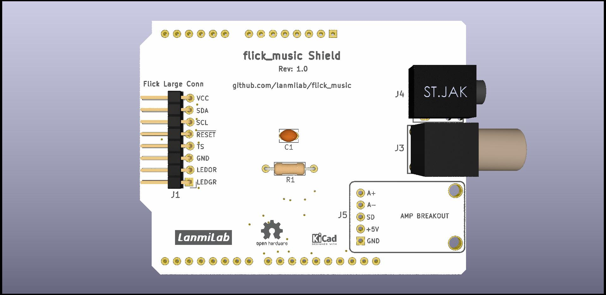

# flick_music Arduino UNO R3 Shield

- Flick Large connects to J1 pin header or to bottom side FPC connector J2. It is not necessary to populate both.

- One audio output option is to solder J3 RCA, another 3.5mm jack connector J4.

- J5 is optional [PAM8302A](https://www.adafruit.com/product/2130) breakout header.

- JP1 jumper. Position 1: Flick large power from +5V(default); Position3: Flick Large power from Ard D10.

- JP2 jumper. Position 1: Amp enable pin(AMPSD) connected to +5V (default); Position3: Amp enable pin connected to Ard D7.
 

[LanmiLab](https://lanmilab.com/)
